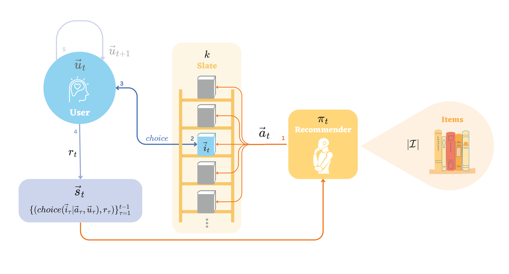

Low Rank Representation Deep Learning for Personalization and Recommendation Systems:
=====================================================================================



Description:
------------
An [gymnasium](https://gymnasium.farama.org) environment for training representation deep learning recommendation model.


Related Work:
On the [formulation of environment and sample-efficient learning method](https://arxiv.org/abs/2309.08622), with PPO as one of the benchmarks,
```
@misc{dai2023representation,
      title={Representation Learning in Low-rank Slate-based Recommender Systems}, 
      author={Yijia Dai and Wen Sun},
      year={2023},
      eprint={2309.08622},
      archivePrefix={arXiv},
      primaryClass={cs.IR}
}
```
